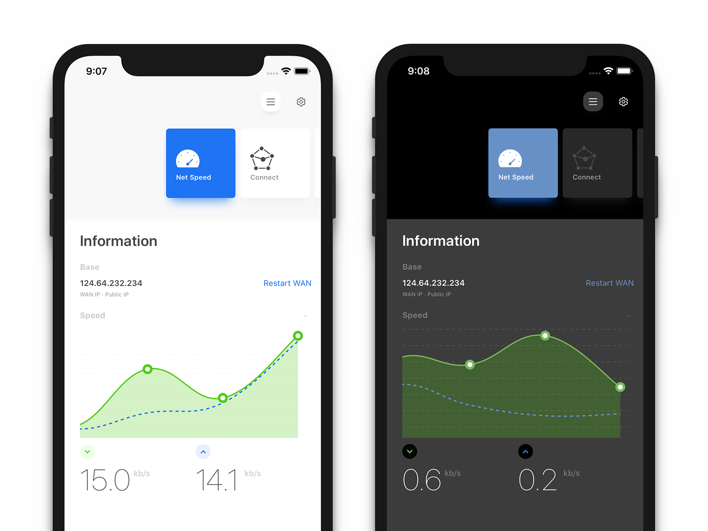

# Plane Router

Plane Router 是一款基於 JSON 腳本運作的 App。

可用於管理路由器、樹莓派、服務器等透過 SSH 訪問的設備。

AtomicR 項目是 PlaneR 的腳本存放位置。

## 商店下載

[https://apps.apple.com/cn/app/小飞机路由控制器/id1452044466](https://apps.apple.com/cn/app/小飞机路由控制器/id1452044466)

## 計劃

- [x] 修正 SS/SSR 切換模式錯誤
- [ ] 加入科學上網插件切換開關
- [ ] 修正 Ping 對 ipv6 的支持

## 加入討論

##### Telegram 討論組

https://t.me/planeroutapp

## 截圖

