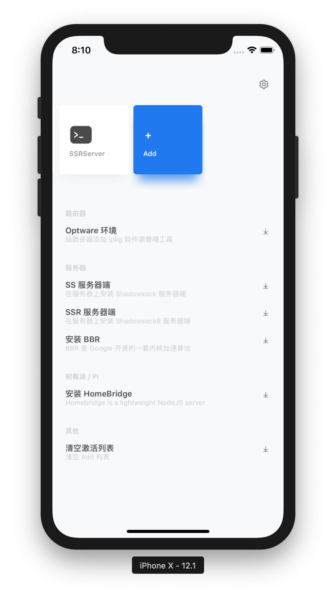

# Plane Router

Plane Router 是一款基於 JSON 腳本運作的 App。

可用於管理路由器、樹莓派、服務器等透過 SSH 訪問的設備。

AtomicR 項目是 PlaneR 的腳本存放位置。

## 公测版本

https://testflight.apple.com/join/6Sh4OA2b

公测版本存在很多问题，可使用 GitHub issues 反馈

## Service

shadowsocks 系列脚本来源：

https://www.flyzy2005.com/fan-qiang/shadowsocks/install-shadowsocks-in-one-command/

## Screen

##### Version 2

##### Version 1

