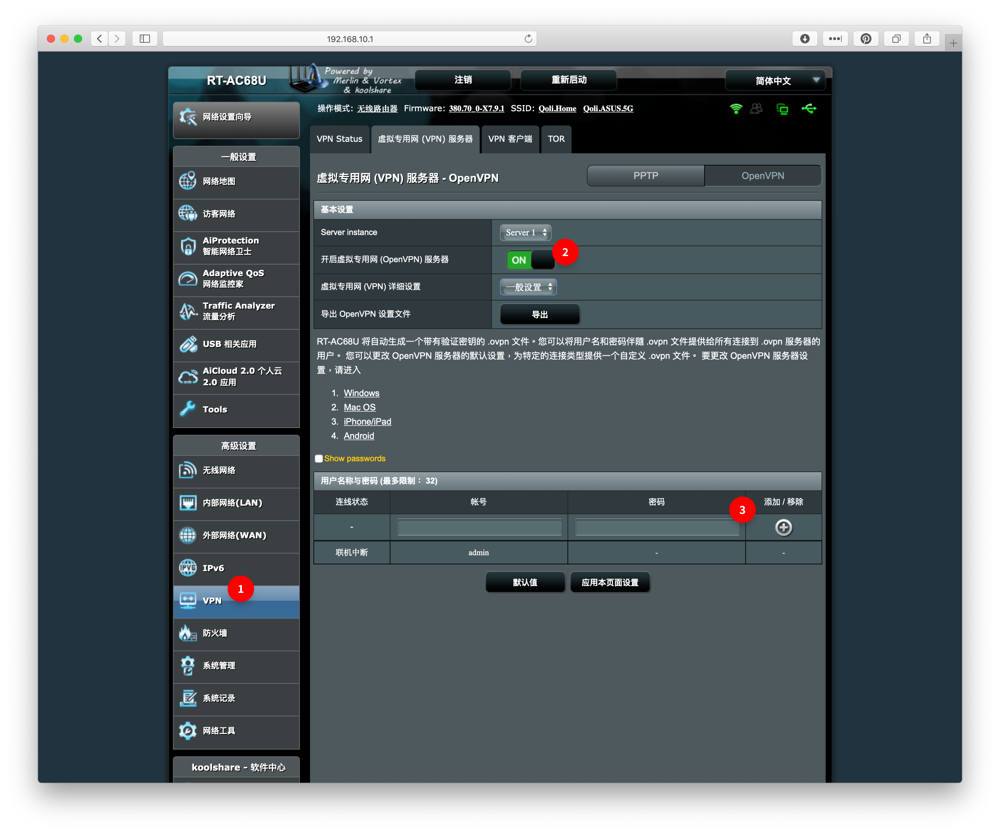
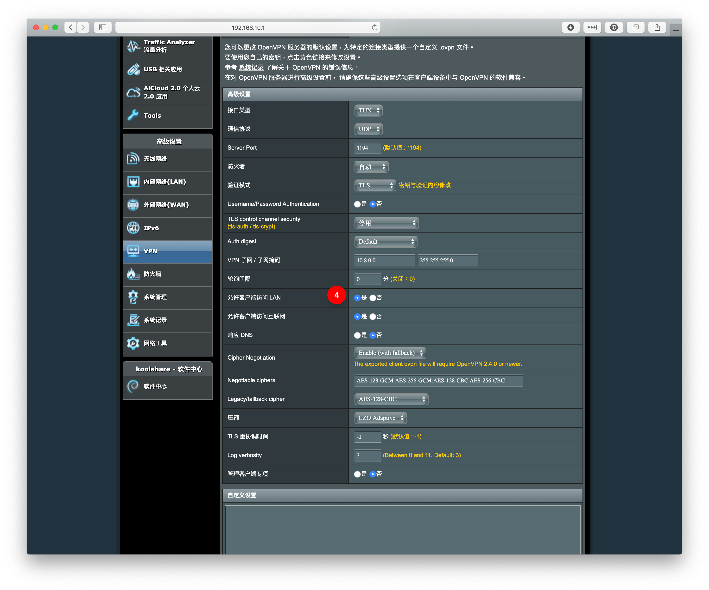

# 如何远程调试？

Plane Router App 可能依然存在一些 Bug。

如果，你愿意让开发作者进行调试一些问题，请私信开发作者。

##### Telegram

https://t.me/PlaneRouterApp

##### E-Mail

qoli@me.com

## 远程调试的必要条件

* 必须有公网 IP

## 开启远程调试

ASUS 系列路由器都内建了 VPN 功能，所以，我们的远程调试方案是基于 VPN 进行的。

### 开启 ASUS 路由器的 VPN

1. 在左边选择 VPN（**位置 1**）
2. 选择 OpenVPN 方案
3. 选择“开启虚拟专用网服务器”（**位置 2**）
4. 如果想自定義 VPN 賬號密碼，请在**位置 3** 增加一个新的账号密码
5. 详细设置调整为“**高级**” （在**位置 2** 的下一栏）
6. 需要确认**允许客户端访问 LAN** 已经为是（**位置 4**）
7. 把详细设置调整为“一般”
8. 导出 OpenVPN 文件
9. 最後把 OpenVPN 文件和路由器的賬號密碼告知軟件作者

---

感谢你们的使用

2019年03月13日