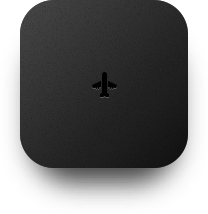
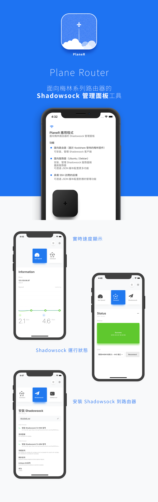

# 邀請加入測試

Plane Router 是一個梅林系列路由器的 Shadowsock 管理面板工具。

他可以透過 JSON 腳本拓展其管理功能到更多的設備。

### 功能介紹

##### 面向路由器（基於 Koolshare 發佈的梅林固件）

* 可安裝、管理 Shadowsock 客戶端

##### 面向服務器（Ubuntu / Debian）

* 安裝、管理 Shadowsock 服務器端

* 重啟服務器
* 可透過 JSON 腳本配置更多功能

##### 具備 SSH 訪問的設備

* 可透過 JSON 腳本配置對應的管理功能

## 測試連接

https://testflight.apple.com/join/6Sh4OA2b

##### 反饋意見：

<https://t.me/planeroutapp>

